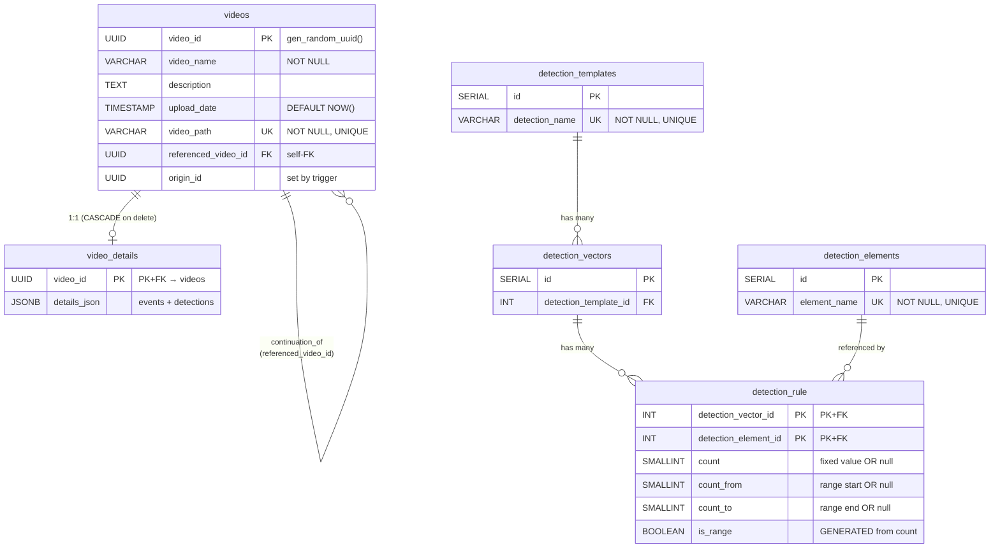

```mermaid
erDiagram
    videos ||--o| video_details : "1:1 (CASCADE on delete)"
    videos ||--o{ videos : "continuation_of<br/>(referenced_video_id)"
    detection_templates ||--o{ detection_vectors : "has many"
    detection_vectors ||--o{ detection_rule : "has many"
    detection_elements ||--o{ detection_rule : "referenced by"

    videos {
        UUID video_id PK "gen_random_uuid()"
        VARCHAR video_name "NOT NULL"
        TEXT description
        TIMESTAMP upload_date "DEFAULT NOW()"
        VARCHAR video_path UK "NOT NULL, UNIQUE"
        UUID referenced_video_id FK "self-FK"
        UUID origin_id "set by trigger"
    }

    video_details {
        UUID video_id PK "PK+FK → videos"
        JSONB details_json "events + detections"
    }

    detection_templates {
        SERIAL id PK
        VARCHAR detection_name UK "NOT NULL, UNIQUE"
    }

    detection_elements {
        SERIAL id PK
        VARCHAR element_name UK "NOT NULL, UNIQUE"
    }

    detection_vectors {
        SERIAL id PK
        INT detection_template_id FK
    }

    detection_rule {
        INT detection_vector_id PK "PK+FK"
        INT detection_element_id PK "PK+FK"
        SMALLINT count "fixed value OR null"
        SMALLINT count_from "range start OR null"
        SMALLINT count_to "range end OR null"
        BOOLEAN is_range "GENERATED from count"
    }
```